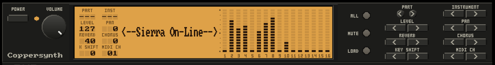

# Coppersynth

Copperline can put a "General MIDI" sound module on the other end 
of the Amiga's MIDI cable. 

The module is Coppersynth, Copperline's own SoundFont
synthesizer in the style of a Roland Sound Canvas: sixteen parts, an
SC-55-style front panel, and an MT-32 translation layer in front, so a
game that talks to an MT-32 plays correctly **with no ROMs and no
configuration**.

Audio is mixed in beside the Amiga's own four channels, so a game that
plays MIDI music and Amiga sound effects gets both.

## Turning it on

The serial port has to be in MIDI mode with Coppersynth as its output. In
the launcher, that is the **I/O Ports** tab (its Serial Port page): set
**Device / Mode** to `MIDI`, then **MIDI output** to `Coppersynth`.
Choosing it reveals the rest of the rows: the SoundFont, the front panel,
and MT-32 mode. In a running session the same choice is under the menu's
**MIDI Out**, where Coppersynth is always offered. On the command line,
`--midi-out coppersynth` selects it and implies MIDI mode.

In the configuration file:

```toml
[serial]
mode = "midi"
midi_out = "coppersynth"
# coppersynth_soundfont = "/path/to/bank.sf2"  # override the built-in bank
# coppersynth_mt32_mode = "auto"               # auto, on, or off
# coppersynth_panel = true                     # start with the front panel shown
```

## `[serial]` keys

| Key | Values | Meaning |
|---|---|---|
| `midi_out` | `"coppersynth"` | Play to the built-in synthesizer instead of a host endpoint |
| `coppersynth_soundfont` | path | A bank to play instead of the built-in one (`.sf2`, or a `.zip` holding one) |
| `coppersynth_mt32_mode` | `"auto"`, `"on"`, `"off"` | How MT-32 traffic is translated (default `"auto"`) |
| `coppersynth_panel` | `true`/`false` | Show the front panel (default `false`) |

## SoundFonts

Coppersynth carries its own bank -- **GeneralUser GS** by S. Christian
Collins, an instrument library in its own right with the complete General
MIDI sound set, SFX bank and drum kits included, at a very reasonable
size -- and needs no extra files. To play a different one, set
`[serial] coppersynth_soundfont`,
use the launcher's **Browse**, or press the panel's **LOAD** button in a
running session; `.sf2` files and `.zip` archives containing one both
load, and the launcher's **Clear** (the menu's **Reset**) puts the
built-in bank back. A bank that does not fill all 128 programs keeps 
honest numbering: an unfilled slot shows its number and the name `Empty`, 
and playback falls back to the bank's default sound.

## MT-32 mode

Games that address an MT-32 -- uploading instruments over sysex,
expecting its patch numbers and drum map -- are translated to General
MIDI as they play. `auto` (the default) translates once MT-32 sysex is
seen and stands down on a GM or GS reset; `on` forces it; `off` never
translates. The mode can be changed live from the menu (**Coppersynth →
MT-32 Mode**) or at the front panel. When the loaded bank carries the GS
CM-64/32L drum kit, MT-32 rhythm selects it automatically.

## The front panel



**Front panel** in the launcher row, the menu toggle, or
`[serial] coppersynth_panel`
puts the module's fascia under the display: the backlit LCD with the part
values, the sixteen-part level meters, and the sound's name -- a game's
MT-32 instrument uploads via SysEx to show extra info. Buttons press with a
left click; a right click latches a button down, which is how multi-button
gestures are made: latch one half of a pair and click the other to view
that setting across all parts, or latch **ALL** and click **MUTE** to
monitor (solo) the shown part.

| Button | Function |
|---|---|
| **PART < >** | Selects a part |
| **INSTRUMENT < >** | Changes the timbre/sound for the selected part |
| **LEVEL < >** | Volume ceiling |
| **PAN < >** | Pans the part left or right |
| **REVERB < >** | Reverb DSP level |
| **CHORUS < >** | Chorus DSP level |
| **KEY SHIFT < >** | Transposes the part |
| **ALL** | Lit, sets all of the above parameters for every part |
| **MUTE** | Silences the shown part (all of them, with **ALL** lit) |
| **MIDI CH < >** | Sets the MIDI channel (1-16) for the selected part |
| **VOLUME** (knob) | The module's main output level, separate from anything MIDI sends |
| **POWER** | Switches the module off and on |

### Button combinations

Coppersynth front panel has various features accessed with multi-button
combinations. The POWER combinations require the unit to first be powered
off; the others work on a running unit.

**Right click to hold/latch.** A held ALL or MUTE flashes to say it is
standing in; holding one while the other is held releases both.

| Combination | Reaches |
|---|---|
| ALL (held) + MUTE | Solo the selected PART. MUTE again immediately un-soloes and lets ALL go; any other press keeps the solo and releases ALL |
| MUTE + MIDI CH < or > | Device ID (1-32, default 17). MIDI CH buttons change it, ALL confirms, MUTE cancels |
| MUTE + CHORUS < or > | Chorus Type (0-8: Off, Chorus 1-3, Celeste 1-2, Flanger, Feedback Chorus, Short Delay). CHORUS buttons change it and each sounds as selected, ALL confirms, MUTE cancels |
| MUTE + INSTRUMENT < or > | Part parameters (portamento time and switch, sostenuto, soft, vibrato rate/depth/delay, cutoff, resonance, envelope attack/decay/release). INSTRUMENT buttons browse, LEVEL buttons set 0-127 sounding live, PART buttons change part, ALL keeps, MUTE restores |
| INSTRUMENT < + POWER | MT-32 Mode. MUTE disables, ALL enables |
| INSTRUMENT > + POWER  | Load the default SoundFont. MUTE cancels, ALL confirms  |
| PART < + PART > + POWER | Demo sequences. press ALL to play, MUTE to stop, PART buttons to skip song. 
| Both INSTRUMENT buttons + both MIDI CH buttons | Show version info + credits

## MIDI implementation

Coppersynth receives the SC-55mkII's controller set: bank select
(MSB, latched until the program change), modulation, portamento time
and switch, data entry, volume, pan, expression, hold, sostenuto,
soft, portamento control (glide without re-trigger), reverb and
chorus sends, RPNs (bend range, fine and coarse tune), the GS NRPNs
(vibrato rate/depth/delay, cutoff, resonance, envelope
attack/decay/release, and the drum set's per-note pitch, level, pan
and effect sends), all-sound-off, reset-all-controllers (to the
unit's own default table), all-notes-off, and the channel mode
messages (omni as all-notes-off, mono, poly). Channel and polyphonic
pressure are received and offered to the bank's modulators, routed
nowhere by default -- as on the hardware.

## Building without it

The `coppersynth` Cargo feature, on by default, compiles the synth in.
To build without it:

```sh
cargo build --release --no-default-features \
  --features "midi,frontend,wasm-boards,control,ctl-bin,net-nat,net-bridge,fluxbridge,mt32,cpu-jit,profile-stats,game-library,mhi"
```

This is the normal desktop feature set with only `coppersynth` omitted.
The launcher rows and the MIDI Out entry disappear, and a configuration
naming `midi_out = "coppersynth"` is refused with a warning that says
what to rebuild with.

## Coppersynth and the MT-32

Both modules can be configured; one is on the cable at a time. The MT-32
is the real instrument, bit-exact, and needs its ROMs; Coppersynth is the
module for playing without them, and its translation aims to be close
rather than identical -- General MIDI instruments standing in for the
MT-32's. Switching between them from the menu's **MIDI Out** needs no
restart.
