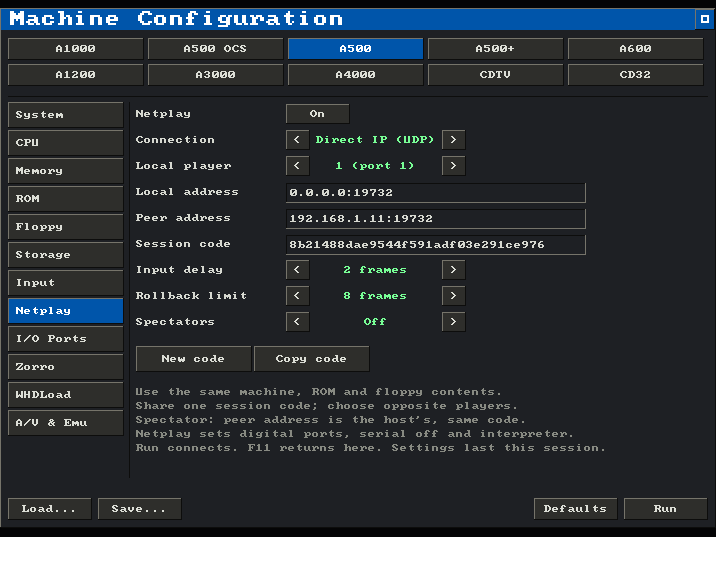

# Rollback netplay

Copperline can run a two-player floppy game across two native desktop instances.
Each peer emulates the whole Amiga and owns one controller port. Both players
see their own input after a small configurable delay. Copperline predicts late
remote input, then restores and replays frames when that prediction was wrong.
This follows the approach described by [GGPO](https://github.com/pond3r/ggpo);
it uses Copperline's own Rust implementation and wire protocol.

This first version connects directly to a known peer. There is no lobby, relay,
NAT traversal, spectator mode, reconnect, or browser support. Use the same
Copperline build on both machines. Cross-platform peer combinations have not
yet been qualified.

## Set up in the GUI

Open **Machine Configuration → Netplay** (or start Copperline with no arguments).
Choose the machine, ROM and floppy images on the existing configuration pages,
then enable **Netplay** on both computers.



1. Choose **Player 1** on one computer and **Player 2** on the other.
2. Leave **Local address** at `0.0.0.0:19732` to listen on all local IPv4
   interfaces. Set **Peer address** to the other computer's reachable IP and
   port, for example `192.168.1.11:19732`. For IPv6, use bracketed addresses
   such as `[::]:19732` and `[2001:db8::2]:19732` on both peers.
3. One player clicks **New code**, then **Copy code**, and shares it with the
   other player. The other player pastes that code into **Session code**.
   Cmd+V on macOS or Ctrl+V elsewhere replaces the focused address/code box;
   Return commits an edit and Escape cancels it.
4. Use the same **Input delay** and **Rollback limit**, then click **Run** on
   both computers. The windows wait for each other before emulation begins.

Enabling netplay changes mouse/analogue/empty ports to joysticks, turns serial
and JIT off, disables run-ahead and warp boot, and enables power on. Existing
joystick/CD32 ports stay selected. These changes are visible on the other
configuration pages; Run reapplies them after model or configuration changes.
ROMs, media and storage selections remain yours to choose;
Run explains any incompatible device or connection setting.

**F11** disconnects and returns to the Netplay page with the connection details
intact. A connection failure also returns there, showing its error. Correct the
settings and press Run on both peers to start again from cold boot. The peer
addresses, session code, player and delay/window settings are kept for the current
app session; Save does not put them in machine configuration files.

The GUI and CLI use the same protocol and can connect to each other.
An app started with a control or GDB endpoint must be restarted without that
endpoint before enabling netplay in the GUI.

## Start from the command line

Give both players the same ROM, floppy contents, and machine settings. A floppy
can come from the configuration or `--insert-disk-after 0 df0 PATH`. Paths can
differ between computers; Copperline checks the loaded contents. Put any
additional disks in the other configured drives before starting. Media swaps
are unavailable during a session.

For example, on a LAN where the players are `192.168.1.10` and `192.168.1.11`:

```sh
# Player 1, on 192.168.1.10:
copperline --factory --model A500 --serial off --port1 joystick --port2 joystick \
  --netplay-bind 0.0.0.0:19732 --netplay-peer 192.168.1.11:19732 \
  --netplay-player 1 --netplay-session 8b21488dae9544f591adf03e291ce976 \
  --insert-disk-after 0 df0 game.adf KICK13.ROM

# Player 2, on 192.168.1.11:
copperline --factory --model A500 --serial off --port1 joystick --port2 joystick \
  --netplay-bind 0.0.0.0:19732 --netplay-peer 192.168.1.10:19732 \
  --netplay-player 2 --netplay-session 8b21488dae9544f591adf03e291ce976 \
  --insert-disk-after 0 df0 game.adf KICK13.ROM
```

Use a fresh 32-digit hexadecimal session ID for each game, shared with your
peer; `openssl rand -hex 16` generates one. The example ID is illustrative.
Allow the chosen UDP port through each host's firewall. Across the internet,
both endpoints must be reachable at the addresses given to the other peer,
usually through port forwarding or a private VPN. A VPN also supplies transport
encryption and authentication: the netplay protocol itself sends inputs in
cleartext, and its session ID distinguishes games rather than authenticating a
person. Connect only to a trusted peer.

Both windows wait until their initial machine fingerprints match. Different
build versions, ROMs, disk contents, controller devices, RAM, or hardware settings
stop the connection. A fitted guest clock defaults to 2000-01-01 UTC for netplay;
use the same `--rtc-time` on both peers to choose another starting time.

## Controls

Player 1 controls Amiga port 1; player 2 controls port 2. On either computer,
a connected gamepad drives the local port. Without a gamepad, the first keyboard
controller mapping drives it: by default arrows move, right Ctrl fires, and
left Alt is the second button. The existing saved input mappings apply.
Either port may be `joystick` or `cd32`, provided both peers use the same settings.

Press **F12** to switch between keyboard controller mode and typing on the
Amiga keyboard. Typing mode sends keys such as Return and the arrows to the guest
instead of consuming them as controller bindings. Keyboard input from the two
peers is combined: a key stays pressed while either player holds it. Losing
window focus releases local held controls on the next sampled frame.

The host Quit and Fullscreen shortcuts remain available (Cmd+Q/Cmd+F on macOS,
Alt+Q/Alt+F elsewhere). Menus, resets, pause, debugger access, mouse input, save
states, and media changes are unavailable while connected. Press F11 to return to setup, or close the window to end the session;
the remaining peer stops after its timeout.

## Delay and connection limits

| Option | Default | Range | Purpose |
| --- | --- | --- | --- |
| `--netplay-delay` | 2 | 0–6 frames | Delays local input to reduce corrections |
| `--netplay-rollback` | 8 | 1–12 frames | Caps prediction while waiting for input |

Both peers must choose the same values. At PAL's nominal 50 Hz, two frames are
about 40 ms. Zero delay gives immediate local input but can produce more visible
corrections. Rollback reduces perceived latency; it cannot remove network delay.
If input or its acknowledgement falls too far behind, emulation waits and resumes
when it arrives. History uses at most 256 MiB; an oversized snapshot window stops
with a memory-budget error.

Unacknowledged inputs are retransmitted, so loss, duplication, and reordering do
not by themselves lose button transitions. Confirmed machine states are checked
every 60 frames. A mismatch stops the session with the affected frame number.
Connection setup times out after 60 seconds; an established connection stops
after 10 seconds without a valid peer packet.

Audio plays once on the initial execution of a frame. Replayed frames are silent.
A sound already played from an incorrect prediction cannot be taken back, so
large corrections can produce audible as well as visual discontinuities.

## Supported machines and verification

Use a cold boot with interpreter execution, both digital controllers, serial off,
and rewind/run-ahead disabled. Floppy images become session-local memory images;
guest disk writes can be rolled back and do **not** modify the original files.
Disk changes and in-session saves are not persisted.

Host directory volumes (including `--run` and WHDLoad staging), hard-drive/ATAPI
images, physical drives, live networking/MIDI/parallel peripherals, CD images,
persistent NVRAM, debugger traces, and recordings are excluded. These devices or
observers have state outside the rollback snapshots. A state file cannot be used
to bypass these restrictions: this version does not accept `--load-state` or USS
imports for netplay.

The Toccata sound board is also excluded: its rate-specific resamplers do not
yet produce a stable byte order for the checkpoint hashes.

For headless verification, both commands can add `--noaudio` and a
`--screenshot-after SECS PATH` with the same timestamp. Scheduled captures wait
for actual remote input and acknowledgement of the local input before rendering
and exiting. `--press-after` and `--key-after`
feed the synchronized keyboard; `--joy-after ... PORT` must name that peer's
own port. Input schedules belong to each peer and need not be identical.

The local smoke check starts both peers, schedules a button press on each, and
compares confirmed PNGs and checkpoint logs:

```sh
python3 tools/check-netplay.py --binary target/release/copperline
# Add identical machine options after --, for example:
python3 tools/check-netplay.py --seconds 10 -- --config game.toml
```

The implementation and regression-test plan are described in
[Netplay internals](../internals/netplay.md).
